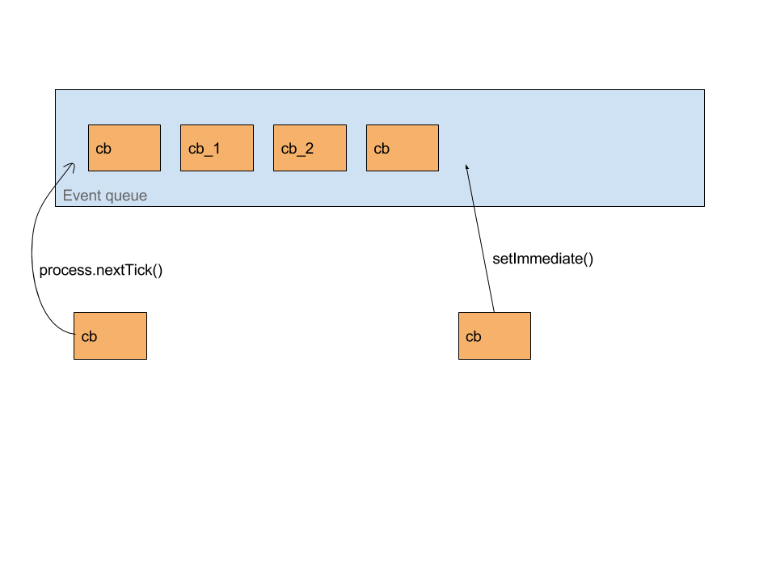

This essay is an extension to my latest [YouTube video][2], where I've explained the __event-loop__ in Node/JavaScript. There were some things, which I wanted to touch upon in the video, but didn't as I thought, it would have made the video quite complex to assimilate, for newbies.

Hence, I decide to write this essay. I will draw reference to my YouTube video, in this essay, so if you are not clear about what an event-loop is, you may want to check the video out.

So, basically I wanted to touch upon __setImmediate()__ and __process.nextTick()__

Let's talk about setImmediate() first, it's just like:

    setTimeout(cb, 0)
    
So, it makes sure that your 'cb' will be put on the event-queue, almost immediately, as timer runs for 0 milliseconds. So the function comes handy in situations where you just to send some task to background without blocking the main program. That's all I got for _setImmediate()_.

Another interesting function is __process.nextTick()__

Let's suppose you have five callbacks in your event-queue, and at this particular moment your call stack is not empty. If you you want something to run first, even before other pending callback, in the event-queue, waiting to be executed, what would you do? We know that event-loop is a FIFO, so whatever is queued first, will be dequeued first.

Luckily, we have a solution to this problem, in the form of _process.nextTick()_. If you do something like

    process.nextTick(cb)   // where 'cb' is a callback function
    
the 'cb' will be queued, right before the head of our queue, so that technically makes 'cb' the head of our event-queue. So, once the event-loop finds the call stack empty, our 'cb' would be the first thing to be put on call stack, hence eventually run

### setImmediate() vs process.nextTick(), you ask?
I've prepared the following diagram, just to explain that visually. As we've seen earlier, _process.nextTick()_ will enqueue the item at the head of our event-queue. On the other hand _setImmediate()_ will follow the conventional route of enqueuing the callback at the tail of the event-queue.

If you are not clear about what a 'tick' is, exactly. I would request you to check this [stackoverflow][1] answer out, I couldn't have explained it better.

[1]: http://stackoverflow.com/a/19823583
[2]: https://youtu.be/QqSgHuoCmZE